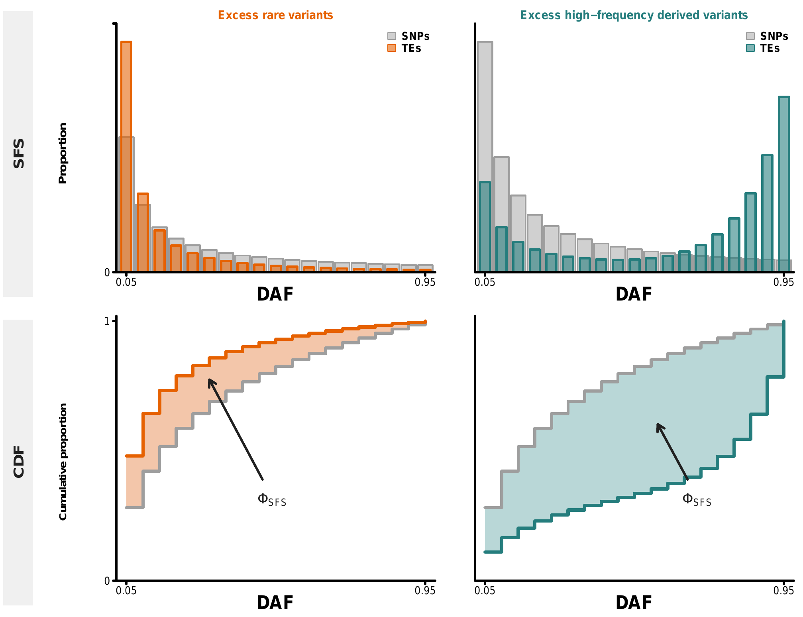
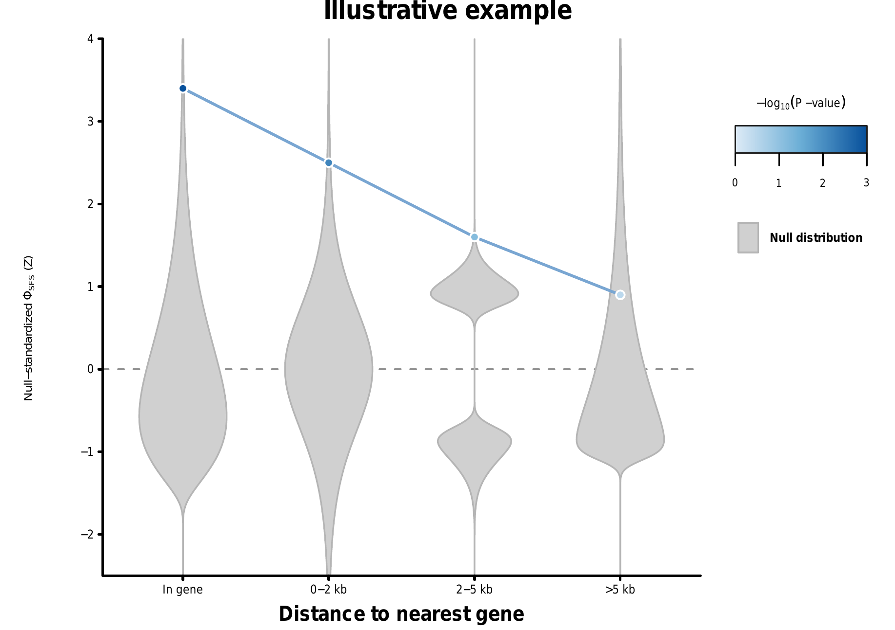

# normalizeTE v0.7.0

normalizeTE builds neutral SNP control sets matched to the posterior ages of a focal
variant category, then compares their unfolded site-frequency spectra. Dataset A may
be either TEs or SNPs; dataset B is currently SNPs. The production workflow therefore
supports the primary TE-versus-SNP analysis and SNP-versus-SNP negative controls.

The alternative pipeline for estimating the PDF of derived allele ages for a
sample is found [here](derived_distribution_readme.md).

This README is the operator guide. Method definitions and the evidence behind the
production settings are linked under [Methods and validation](#methods-and-validation).

## Citation

If you use normalizeTE or the Phi-SFS method, please cite:

> Liu, B., Munasinghe, M., Fairbanks, R. A., Hirsch, C. N., and Ross-Ibarra, J. (2025).
> Genome-wide selection on transposable elements in maize. bioRxiv 2025.09.16.676665.
> <https://doi.org/10.1101/2025.09.16.676665>

## Repository layout

- `normalize_tes/` contains the production package and supported command modules.
- `tools/` contains development benchmarks, diagnostics, probes, and simulations.
- `slurm/` contains scheduler launchers and their shared conda bootstrap helper.
- `tests/` contains the complete test suite.
- `docs/` contains methods, validation records, plans, reviews, and the changelog.

Run production commands from the repository root with
`python -m normalize_tes.COMMAND`; examples below use that form throughout.

## Before you start

Create the environment and run the tests on a Linux compute node:

```bash
conda env create -f environment.yml
conda activate normalizeTE
python -m pytest -q tests
```

Use an immutable release tag or commit for production:

```bash
git fetch --tags
git checkout COMMIT_HASH
```

The workflow expects:

- posterior ARG draws; the ancestry and TE-polarity stages require tszip archives;
- SNP and TE position files with two whitespace-separated columns: chromosome and
  1-based VCF position;
- chromosome labels matching the ARG metadata or a compatible chromosome-offset
  file supplied when the store is built;
- a filtered, genome-wide, biallelic VCF in which TE ALT encodes insertion/presence;
- node-local `$TMPDIR` for interval-store and target scratch data;
- durable storage for published outputs and matcher resume state.

Blank lines and `#` comments are allowed in position files. Run each script with
`--help` for its complete input contract and advanced options.

## Configure one category

Set these paths once and use them throughout the commands below:

```bash
POSTERIOR_DIR=/path/project-data/posterior
CHROM_OFFSETS=/path/project-data/chrom_offsets.txt
SNP_POSITIONS=/path/project-data/snp/all_snp.pos.txt
ALL_TE_POSITIONS=/path/project-data/te/all_te.pos.txt
TE_POSITIONS=/path/project-data/te/in_gene.pos.txt
A_POSITIONS="$TE_POSITIONS"
A_TYPE=TE
B_TYPE=SNP
VCF=/path/variants.vcf.gz

STORE=results/age_interval_store
CANDIDATES=results/candidate_rows.npy
PRELIM_TARGET=results/targets/in_gene_prelim
POLARITY_MASK=results/te_polarity_masks/in_gene
TARGET=results/targets/in_gene
MATCHES=results/bootstrap_matches/in_gene
WORK_DIR=results/work/in_gene
ANCESTRAL=results/ancestral_states
ELIGIBILITY=results/vcf_eligibility
PHI=results/phi_sfs/in_gene

mkdir -p results results/targets results/te_polarity_masks \
  results/bootstrap_matches results/work results/phi_sfs
```

Every published output path must be new. The tools refuse to overwrite existing
artifacts.

## Run the pipeline

The commands below show the production TE-versus-SNP path and note the changes for a
SNP-versus-SNP negative control. Run heavy commands inside a scheduled compute
allocation, not on a login/head node.

### 1. Build the interval store

Build one reusable posterior-age store for all categories:

```bash
python -m normalize_tes.build_snp_interval_store \
  "$POSTERIOR_DIR"/*.tsz \
  --interval-store "$STORE" \
  --chrom-offsets "$CHROM_OFFSETS" \
  --min-usable-fraction 0.1 \
  --num-buckets 100 \
  --bucket-memory-gb 2 \
  --scratch-dir "${TMPDIR:?TMPDIR is not set}"
```

| flag | purpose |
|---|---|
| `trees` | posterior ARG draws, one tree sequence per draw |
| `--interval-store` | new store directory to publish |
| `--chrom-offsets` | chromosome offsets when compatible metadata is not embedded in every ARG |
| `--min-usable-fraction` | minimum fraction of draws with a usable age interval for an eligible row |
| `--num-buckets` | number of temporary row partitions; increase this to reduce per-bucket memory |
| `--bucket-memory-gb` | per-bucket sort-memory ceiling |
| `--scratch-dir` | temporary bucket location; use node-local scratch |

Omit `--chrom-offsets` only when every draw contains compatible chromosome metadata.
The completed store records a content digest used by downstream identity checks, and a
content identity for each source draw so that later steps can prove they were handed the
same posterior, wherever those files now live.

A store built before v0.7.0 records only a path per draw, so moving the draws makes every
later step reject them. Record their identities in place -- this does not change the
store's content digest, and leaves artifacts already stamped with it valid:

```bash
python -m normalize_tes.record_draw_identities \
  --store "$STORE" \
  "$POSTERIOR_DIR"/*.tsz
```

Pass `--dry-run` first to see what it would change. The files are matched to the store's
recorded draws by name, one to one, because an unauthenticated store offers nothing
better; where the store already carries identities, the content must match and only the
path moves.

### 2. Build the ancestral-state table

Build one store-aligned ancestral-state table. It supplies the posterior SNP
orientation probabilities used for both SNP A sites and SNP B controls:

```bash
python -m normalize_tes.build_ancestral_states \
  --store "$STORE" \
  --output "$ANCESTRAL" \
  "$POSTERIOR_DIR"/*.tsz
```

| flag | purpose |
|---|---|
| `--store` | store whose rows and source draws the table must match |
| `--output` | new ancestral-state table directory |
| `trees` | the store's complete posterior draw set |

Each draw is authenticated against the store by content rather than path. For an
array build, use `--draws START:STOP` for each part and merge the parts with
`--merge ... --expect-draws N`; the launcher example below shows this pattern.

### 3. Build the shared VCF eligibility artifact

Scan the analysis VCF once before fixing the focal-site count or matching controls:

```bash
python -m normalize_tes.vcf_eligibility \
  --vcf "$VCF" \
  --store "$STORE" \
  --ancestral-table "$ANCESTRAL" \
  --output "$ELIGIBILITY" \
  --min-callable 20 \
  --heterozygous error
```

| flag | purpose |
|---|---|
| `--vcf` | filtered biallelic analysis VCF |
| `--store` | interval store defining the row universe |
| `--ancestral-table` | authenticated posterior ancestral-state counts for SNP orientation |
| `--output` | new eligibility directory |
| `--min-callable` | minimum callable individuals per site; production uses 20 |
| `--heterozygous` | reject heterozygous inbred calls, or treat them as missing |

The artifact contains a shared genotype/callability mask and, for SNPs, the subset
with at least one usable ARG orientation plus the full posterior orientation
probability. Use this same artifact for A and B. Here lowercase $m=20$ is the number
of individuals used by the SFS projection; uppercase $M$ below is the number of sites
in each compared set.

### 4. Build the candidate control universe

Restrict controls to the filtered SNP list and exclude all known TE positions:

```bash
python -m normalize_tes.build_candidate_rows \
  --store "$STORE" \
  --include-positions "$SNP_POSITIONS" \
  --exclude-positions "$ALL_TE_POSITIONS" "$A_POSITIONS" \
  --vcf-eligibility "$ELIGIBILITY" \
  --output "$CANDIDATES" \
  --min-resolved-fraction 0.70
```

| flag | purpose |
|---|---|
| `--store` | store whose canonical rows are being selected |
| `--include-positions` | filtered SNP positions allowed in the control universe |
| `--exclude-positions` | all known TEs and every A position to remove from B |
| `--vcf-eligibility` | restrict B to callable, SNP-orientable rows before matching |
| `--output` | new candidate-row `.npy`; a provenance report is written beside it |
| `--min-resolved-fraction` | minimum fraction of requested positions that must resolve to store rows |

Candidate rows are store-specific. Rebuild this artifact whenever the store changes.
Excluding `A_POSITIONS` is essential for SNP-versus-SNP runs; it is harmlessly
redundant when A is a subset of `ALL_TE_POSITIONS`.
The justification for the production resolution threshold belongs in the validation
record, not in this how-to.

### 5. Build the preliminary TE target

The preliminary target supplies the ordered TE rows needed to build the polarity
mask. It is not the target used for matching.

```bash
python -m normalize_tes.te_age_target \
  --store "$STORE" \
  --te-positions "$TE_POSITIONS" \
  --output "$PRELIM_TARGET" \
  --a-type TE \
  --scratch-dir "${TMPDIR:?TMPDIR is not set}" \
  --bootstrap-replicates 10000 \
  --acceptance-quantile 0.50 \
  --seed 1002
```

| flag | purpose |
|---|---|
| `--store` | interval store supplying TE ages |
| `--te-positions` | TE category to resolve and summarize |
| `--output` | new preliminary target directory |
| `--a-type` | focal type; `TE` here because this preliminary target feeds the TE polarity mask |
| `--scratch-dir` | node-local location for the temporary TE-by-age CDF matrix |
| `--bootstrap-replicates` | TE resamples used to calibrate the matching threshold |
| `--acceptance-quantile` | bootstrap-distance quantile used as that threshold |
| `--seed` | bootstrap random seed |

Keep this directory: the polarity mask records the target it was built against. This
preliminary target intentionally precedes VCF eligibility so the polarity mask covers
the complete resolved TE list. The final target applies both filters before fixing
$M$.

Sizing note: an unmasked target streams its TE-by-age CDF through `--scratch-dir`,
so scratch is the constraint. A masked target (step 5) does not — it builds the
whole CDF block in memory — so there `--mem` is the constraint, and the run prints
its projected peak before building. Measured resource figures are in
[BOOTSTRAP_HPC_VALIDATION.md](docs/BOOTSTRAP_HPC_VALIDATION.md).

### 6. Build the TE polarity mask

Record which posterior draws polarize each TE in agreement with TE presence being
derived. The later threshold retains a TE when at least 50% of its usable ARG draws
support insertion presence as derived, including an exact 50% tie:

```bash
python -m normalize_tes.build_te_polarity_mask \
  --store "$STORE" \
  --target "$PRELIM_TARGET" \
  --output "$POLARITY_MASK" \
  --absence-allele A \
  "$POSTERIOR_DIR"/*.tsz
```

| flag | purpose |
|---|---|
| `--store` | store that defines row and draw IDs |
| `--target` | preliminary target supplying the ordered TE rows |
| `--output` | new category-specific mask directory |
| `--absence-allele` | allele encoding TE absence; default `A` |
| `trees` | every source draw recorded by the store |

Pass the complete draw set. Partial masks are rejected by target construction.

### 7. Build the final target and match controls

Build a new target from agreeing draws, discard TEs above the production flipped-draw
threshold, and construct the matched control sets:

```bash
python -m normalize_tes.te_age_target \
  --store "$STORE" \
  --te-positions "$A_POSITIONS" \
  --output "$TARGET" \
  --scratch-dir "${TMPDIR:?TMPDIR is not set}" \
  --a-type "$A_TYPE" \
  --vcf-eligibility "$ELIGIBILITY" \
  --te-polarity-mask "$POLARITY_MASK" \
  --max-flipped-fraction 0.5 \
  --bootstrap-replicates 10000 \
  --acceptance-quantile 0.50 \
  --seed 1002

python -m normalize_tes.bootstrap_target_matcher \
  --store "$STORE" \
  --target "$TARGET" \
  --candidate-rows "$CANDIDATES" \
  --output "$MATCHES" \
  --work-dir "$WORK_DIR" \
  --resume \
  --replicates 1001 \
  --restarts 3 \
  --disjoint-replicates \
  --seed 1002
```

Final-target additions:

| flag | purpose |
|---|---|
| `--te-polarity-mask` | use only agreeing posterior draws for each TE age CDF |
| `--max-flipped-fraction` | discard a TE only when its flipped fraction exceeds this value; `0.5` retains exact ties |
| `--a-type` | focal dataset type, `TE` or `SNP` |
| `--vcf-eligibility` | apply the appropriate TE or SNP eligibility rows before fixing $M$ |

Matcher flags:

| flag | purpose |
|---|---|
| `--store` | store supplying candidate SNP ages |
| `--target` | final masked target |
| `--candidate-rows` | TE-excluded control universe and its provenance sidecar |
| `--output` | new matched-control bundle |
| `--work-dir` | durable per-replicate state used by `--resume` |
| `--resume` | continue an interrupted compatible run |
| `--replicates` | total matched control sets; production uses 1001 for one reference plus 1000 nulls |
| `--restarts` | optimization restarts per control set |
| `--disjoint-replicates` | prevent reuse of a control SNP between published sets |
| `--seed` | matching random seed |

The preliminary and final TE targets must use different directories. Keep `WORK_DIR`
on durable storage and repeat the identical command after preemption. Disjoint mode
preflights the necessary pool size: at least `replicates` times $M$ eligible candidates
must exist. It then removes every published control from later candidate pools. If the
pool cannot support all sets, the run fails; it never falls back to reuse.

For a SNP focal set, build `TARGET` directly with `--a-type SNP`,
`--te-positions "$A_POSITIONS"`, and `--vcf-eligibility "$ELIGIBILITY"`; omit
`--te-polarity-mask` and `--max-flipped-fraction`. Despite the historical flag and
array names, those positions define A. A SNP uses the same eligibility and posterior
orientation rule as B, and its rows must already have been excluded from `CANDIDATES`.

### 8. Calculate Phi-SFS

Calculate the unfolded SFS comparison for focal set A and every matched B set:

```bash
python -m normalize_tes.phi_sfs \
  --target "$TARGET" \
  --matches "$MATCHES" \
  --vcf "$VCF" \
  --ancestral-table "$ANCESTRAL" \
  -A "$A_TYPE" \
  -B "$B_TYPE" \
  --reference-replicate 0 \
  --min-null-replicates 1000 \
  --output "$PHI"
```

| flag | purpose |
|---|---|
| `--target` | final focal A target |
| `--matches` | matched-control bundle from step 7 |
| `--vcf` | filtered genome-wide biallelic VCF covering all requested sites |
| `--ancestral-table` | store-aligned posterior ancestral-state table |
| `-A`, `--a-type` | focal type: `TE` (default) or `SNP` |
| `-B`, `--b-type` | control type; currently `SNP` only |
| `--reference-replicate` | prespecified matched replicate held fixed as $B_0$ |
| `--min-null-replicates` | required QC-passing null sets after reserving $B_0$; default 1000 |
| `--output` | new Phi-SFS result directory |

The default rejects heterozygous calls. Use `--heterozygous missing` only when the
eligibility artifact was built with the same policy. Eligibility is fixed upstream;
the calculation asserts that A and every accepted B set retain exactly the same $M$
sites rather than silently dropping or downsampling sites.

#### Wasserstein definition

The revised statistic compares the normalized cumulative unfolded SFS of a focal
set $A$ with that of an age-matched neutral SNP set, $B_0$. Let $F_A(x)$
and $F_{B_0}(x)$ be their CDFs on the derived-allele-frequency (DAF) axis. Define

$$
\Phi_{\mathrm{SFS}}(A,B_0)
= W_1(A,B_0)
= \int_0^1 \left|F_A(x)-F_{B_0}(x)\right|\,dx.
$$

For equally spaced projected DAF bins $x_j=j/m$, calculate this exactly as

$$
\Phi_{\mathrm{SFS}}(A,B_0)
= \frac{1}{m}\sum_{j=1}^{m-1}
  \left|F_A(x_j)-F_{B_0}(x_j)\right|.
$$

Thus, Φ-SFS is the shaded area between the two CDFs. It is zero only when the
spectra are identical and grows as probability mass must move farther along the DAF
axis. It is unsigned: the CDFs and bin-level residuals show whether the focal set has
an excess of rare or high-frequency derived alleles.



Polarity is type-specific. A retained TE treats insertion presence as derived; the
upstream TE filter retains at least 50% posterior support, including exactly 50%. For
every SNP in A or B, if the observed ALT frequency is $p$ and the fraction of usable
ARG draws in which ALT is derived is $q$, its projected contribution is

$$
q\,h(k,n)+(1-q)\,h(n-k,n).
$$

All $q\in[0,1]$ are retained: there is no SNP `q > 0.5` filter. ARG draws that cannot
orient either observed allele are reported as unusable rather than counted toward
either direction.

#### Null calibration, Z-scores, and P-values

Finite site counts make the distance positive even under neutrality. Calibrate that
sampling floor separately for every focal category rather than comparing raw
Φ-SFS values across categories:

1. For a focal set $A$ containing $M$ variants, generate one reference SNP set $B_0$
   and $R$ additional SNP sets $B_1,\ldots,B_R$. The existing matcher generates all
   $R+1$ sets identically: each independently bootstraps the observed A-site ages and
   matches exactly $M$ SNPs to that bootstrap age CDF. All sets use the shared samples,
   callability, and data-quality rules, with the type-specific polarity rules above.
2. Calculate the observed distance
   $D_{\mathrm{obs}}=\Phi_{\mathrm{SFS}}(A,B_0)$.
3. Calculate the finite-sample null distances
   $D_i^0=\Phi_{\mathrm{SFS}}(B_i,B_0)$, for $i=1,\ldots,R$. Here
   $D_i^0$ is a raw Φ-SFS distance between two neutral SNP sets, not a Z-score.
4. Let $μ_0$ and $s_0$ be the mean and sample standard deviation of the
   $D_i^0$. Report the null-standardized effect size

   $$
   Z_A=\frac{D_{\mathrm{obs}}-\mu_0}{s_0}.
   $$

5. Report the one-sided Monte Carlo P-value

   $$
   P_A=\frac{1+\sum_{i=1}^{R}
   \mathbf{1}\!\left(D_i^0\ge D_{\mathrm{obs}}\right)}{R+1}.
   $$

The production matcher requires these $R+1$ control sets to be globally disjoint.
Thus every control SNP has maximum reuse one and every $B_i$ has zero overlap with
$B_0$. Set 0 is designated as $B_0$ before any SFS is examined; it differs from the
other sets only in being held fixed in the distance calculations.

Use at least $R=1000$ null replicates for a minimum attainable P-value of
$1/1001$, approximately $10^{-3}$. Plot one equal-size point per focal category at
$Z_A$, color it by $-\log_{10}P_A$, and show its category-specific null Z-score
distribution in gray. Cap the displayed color scale at 3 when $R=1000$.



The P-value tests whether a focal spectrum is farther from its matched neutral
background than expected from two finite neutral samples of the same size. The
Z-score describes the magnitude of that departure in category-specific null standard
deviations. Neither identifies the direction of the SFS shift; retain the CDFs and
signed bin residuals for that purpose.

For a formal contrast between categories 1 and 2, use
$\Delta_{\mathrm{obs}}=Z_{A_1}-Z_{A_2}$, construct paired null contrasts
$\Delta_i^0=Z_{1i}^0-Z_{2i}^0$, and compare
$|\Delta_{\mathrm{obs}}|$ with the distribution of $|\Delta_i^0|$. A visual difference
between two points is not by itself a formal between-category test.

The focal A set is observed once and remains fixed. Small or unusual focal sets can
therefore yield unstable results even after null calibration. Always report $M$,
the raw distance, null mean and standard deviation, Z-score, Monte Carlo P-value,
replicate count, and matching diagnostics. Results use the
`phi-sfs-wasserstein-v1` schema and cannot be silently combined with older Phi-SFS
outputs. The implementation design is recorded in
[PHI_SFS_WASSERSTEIN_CODING_PLAN.md](docs/PHI_SFS_WASSERSTEIN_CODING_PLAN.md).

## Farm/Quobyte launchers

Submit launchers with `sbatch` from the repository checkout. The launchers activate
the conda environment themselves. `$TMPDIR` is node-local scratch; matcher
`WORK_DIR` must remain on Quobyte or other durable storage.

Build the polarity mask after the preliminary target exists:

```bash
sbatch --export=ALL,STORE="$STORE",TARGET="$PRELIM_TARGET",OUTPUT="$POLARITY_MASK" \
  slurm/run_te_polarity_mask.sbatch
```

Build the final masked target and match controls:

```bash
sbatch --export=ALL,STORE="$STORE",TARGET="$TARGET",A_POSITIONS="$A_POSITIONS",\
OUTPUT="$MATCHES",CANDIDATE_ROWS="$CANDIDATES",WORK_DIR="$WORK_DIR",\
VCF_ELIGIBILITY="$VCF_ELIGIBILITY",A_TYPE="$A_TYPE",\
TE_POLARITY_MASK="$POLARITY_MASK",MAX_FLIPPED_FRACTION=0.5,\
REPLICATES=1001,RESTARTS=3,SEED=1002,SCRATCH_HEADROOM_GB=32 \
  slurm/run_bootstrap_matching.sbatch
```

The launcher passes the A type and shared eligibility artifact when constructing a
missing target. When `TARGET` already exists, it verifies the recorded A type,
eligibility artifact, TE mask when applicable, and flipped-fraction threshold. It
also rejects an unrestricted candidate universe and verifies that the candidate
provenance names the same eligibility artifact.

Build the ancestral table as an array and merge it after every array task succeeds:

```bash
sbatch --array=0-14 --export=ALL,STORE="$STORE",\
TREES="$POSTERIOR_DIR/*.tsz",OUTPUT=results/ancestral-parts,PER_TASK=5 \
  slurm/run_ancestral_table.sbatch

sbatch --export=ALL,STORE="$STORE",MERGE=1,\
PARTS="results/ancestral-parts/part-*",OUTPUT="$ANCESTRAL",EXPECT_DRAWS=75 \
  slurm/run_ancestral_table.sbatch
```

Calculate Phi-SFS:

```bash
sbatch --export=ALL,TARGET="$TARGET",MATCHES="$MATCHES",VCF="$VCF",\
ANCESTRAL="$ANCESTRAL",OUTPUT="$PHI",A_TYPE="$A_TYPE",B_TYPE=SNP \
  slurm/run_phi_sfs.sbatch
```

This runs either TE-versus-SNP or SNP-versus-SNP according to `A_TYPE`; `B_TYPE`
is currently constrained to `SNP`, matching the command-line interface.

Scheduler allocations, measured resource use, scratch sizing, and parameter evidence
are recorded in [BOOTSTRAP_HPC_VALIDATION.md](docs/BOOTSTRAP_HPC_VALIDATION.md).

### Submit many TE categories

The store, candidate universe, and ancestral table are shared across categories.
Give every category its own preliminary target, polarity mask, final target, matched
bundle, durable work directory, and seed. First create a tab-separated manifest:

```text
label	positions	prelim_target	polarity_mask	target	matches	work_dir	seed
all_te	/quobyte/project/te/all.pos.txt	/quobyte/project/targets/all_te_prelim	/quobyte/project/polarity_masks/all_te	/quobyte/project/targets/all_te	/quobyte/project/matches/all_te	/quobyte/project/work/all_te	1001
in_gene	/quobyte/project/te/in_gene.pos.txt	/quobyte/project/targets/in_gene_prelim	/quobyte/project/polarity_masks/in_gene	/quobyte/project/targets/in_gene	/quobyte/project/matches/in_gene	/quobyte/project/work/in_gene	1002
young	/quobyte/project/te/young.pos.txt	/quobyte/project/targets/young_prelim	/quobyte/project/polarity_masks/young	/quobyte/project/targets/young	/quobyte/project/matches/young	/quobyte/project/work/young	1003
```

The manifest rules are:

- the first line is the header shown above;
- fields are separated by literal tabs and paths must not contain tabs, newlines, or
  commas;
- every `prelim_target` must already have been built from that row's `positions`;
- every other category-specific path must be unique; mask, target, and match paths
  must not exist on a first submission;
- `work_dir` is durable and may be reused only to resume the identical matching run;
- seeds should be fixed before submission and remain unchanged on resubmission.

Set the shared inputs, then submit one mask job and one dependent target/matching job
per manifest row:

```bash
PROJECT=/quobyte/project/normalizeTE
STORE=/quobyte/project/data/age_interval_store
CANDIDATES=/quobyte/project/data/candidate_rows.npy
VCF_ELIGIBILITY=/quobyte/project/data/vcf_eligibility
MANIFEST=/quobyte/project/manifests/te_categories.tsv

while IFS=$'\t' read -r label positions prelim mask target matches work seed; do
  [[ "$label" == label ]] && continue
  [[ -n "$label" ]] || continue

  mask_job=$(sbatch --parsable \
    --job-name="mask-${label}" \
    --export=ALL,PROJECT="$PROJECT",STORE="$STORE",TARGET="$prelim",OUTPUT="$mask" \
    slurm/run_te_polarity_mask.sbatch)
  mask_job=${mask_job%%;*}

  match_job=$(sbatch --parsable \
    --job-name="match-${label}" \
    --dependency="afterok:${mask_job}" \
    --export=ALL,PROJECT="$PROJECT",STORE="$STORE",TARGET="$target",\
A_POSITIONS="$positions",A_TYPE=TE,OUTPUT="$matches",CANDIDATE_ROWS="$CANDIDATES",\
VCF_ELIGIBILITY="$VCF_ELIGIBILITY",\
WORK_DIR="$work",TE_POLARITY_MASK="$mask",MAX_FLIPPED_FRACTION=0.5,\
REPLICATES=1001,RESTARTS=3,SEED="$seed",SCRATCH_HEADROOM_GB=32 \
    slurm/run_bootstrap_matching.sbatch)
  match_job=${match_job%%;*}

  printf '%s\tmask=%s\tmatch=%s\n' "$label" "$mask_job" "$match_job"
done < "$MANIFEST"
```

The categories run concurrently, while each matching job waits for its own mask. Save
the printed job IDs. Check the mask jobs before trusting the dependent runs, and use
`squeue`, `sacct`, and the scheduler logs to confirm that every manifest row completed.

This loop intentionally does not rebuild preliminary targets: no current production
launcher performs a target-only run. Build those targets first using step 3 in
scheduled compute allocations. It also does not silently skip existing masks or
outputs; for a partial rerun, submit only the missing categories or resubmit an
interrupted matcher with its original target, output, work directory, and seed.

## Verify a production run

Before accepting the results:

1. Confirm every artifact records the expected release version, Git commit, and
   non-null input identities in `metadata.json`.
2. Confirm the candidate-row report meets the requested resolution threshold and is
   bound to `STORE` and the intended VCF eligibility artifact.
3. Confirm the final target records `POLARITY_MASK`, the intended
   `max_flipped_fraction`, inclusive at 0.5, the eligibility artifact, and plausible
   kept/discarded counts. For SNP A, confirm `a_type=SNP` and no TE mask.
4. Confirm the matcher published 1001 identically generated sets in disjoint mode,
   maximum control reuse is one, every overlap with $B_0$ is zero, and all sets used
   in Phi-SFS pass matching QC.
5. Confirm the `phi-sfs-wasserstein-v1` result records the intended A/B types, exactly
   equal site count $M$, reference replicate, null count, raw distance, null mean and
   sample SD, Z-score, exceedances, and add-one P-value.

The exact acceptance criteria and the tests supporting them are in
[BOOTSTRAP_HPC_VALIDATION.md](docs/BOOTSTRAP_HPC_VALIDATION.md).

## Outputs

| artifact | purpose |
|---|---|
| `age_interval_store/` | reusable posterior age intervals and store identity |
| `ancestral_states/` | posterior ancestral-base counts for store rows |
| `vcf_eligibility/` | shared callable rows plus SNP posterior-orientation eligibility |
| `candidate_rows.npy` plus `.json` | store-bound, eligibility-filtered control universe excluding known TEs and A |
| `targets/CATEGORY_prelim/` | ordered TE rows used to construct the polarity mask |
| `te_polarity_masks/CATEGORY/` | per-TE, per-draw polarity agreement mask |
| `targets/CATEGORY/` | final masked TE age target and acceptance threshold |
| `bootstrap_matches/CATEGORY/` | disjoint $B_0,\ldots,B_R$ sets, bootstrap targets, restart traces, reuse checks, and QC |
| `phi_sfs/CATEGORY/` | A/B spectra and CDFs, Wasserstein distances, null Z-scores, summary tables, and provenance |

Outputs are published atomically and are never overwritten. The Phi-SFS output schema
is `phi-sfs-wasserstein-v1`; its generic `a_*` and `b_*` arrays support both TE-SNP
and SNP-SNP analyses. Matched-control sets are Monte Carlo null replicates, not
independent biological samples; see the validation report for the correct
interpretation of their spread.

## Methods and validation

- [BOOTSTRAP_HPC_VALIDATION.md](docs/BOOTSTRAP_HPC_VALIDATION.md) — production settings,
  validation tests, measured resources, decision evidence, and acceptance criteria.
- [BOOTSTRAP_TARGET_MATCHING_PLAN.md](docs/BOOTSTRAP_TARGET_MATCHING_PLAN.md) — bootstrap
  target and matching design.
- [PHI_SFS_WASSERSTEIN_CODING_PLAN.md](docs/PHI_SFS_WASSERSTEIN_CODING_PLAN.md) —
  Wasserstein definition, polarity paths, null calibration, and output schema.
- [BOOTSTRAP_DISCARDED_APPROACHES.md](docs/BOOTSTRAP_DISCARDED_APPROACHES.md) — evaluated
  approaches that are not part of the production route.
- [CHANGELOG.md](docs/CHANGELOG.md) — release-level behavior changes.
- [CODE_REVIEW_ROUND9.md](docs/CODE_REVIEW_ROUND9.md) — latest implementation review.

Historical `INTERVAL_STORE_*`, `GLOBAL_QUANTILE_*`, sampler plans, and older code
reviews document development history; they are not operator instructions.
